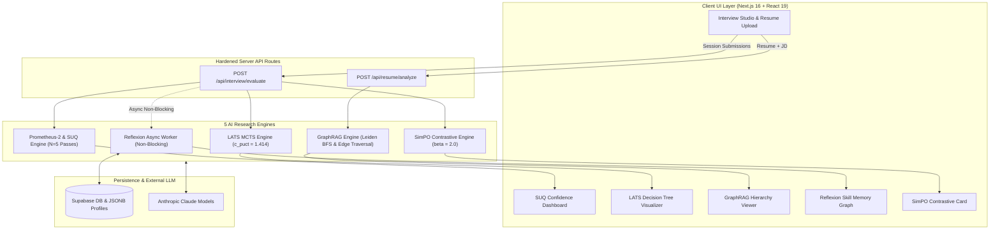

<div align="center">

  <h1>⚡ SKILLO AI</h1>
  <p><strong>Next-Generation Enterprise AI Mock Interview & Resume Intelligence Platform</strong></p>
  <p>Powered by 5 SOTA AI Research Engines: <strong>Prometheus-2</strong>, <strong>LATS (MCTS)</strong>, <strong>GraphRAG</strong>, <strong>Reflexion</strong>, and <strong>SimPO</strong>.</p>

  <br/>

  [](https://nextjs.org/)
  [](https://www.typescriptlang.org/)
  [](https://jestjs.io/)
  [](https://supabase.com/)
  [](https://zod.dev/)

</div>

<br/>

---

## 🚀 Welcome to the Future of Technical Hiring Intelligence

**Skillo AI** is an enterprise-grade AI technical interview simulation and resume intelligence platform built on the **Next.js 16 App Router**. 

Unlike conventional interview prep apps that rely on single-pass LLM prompts or static questions, **Skillo AI implements five breakthrough AI research architectures directly from ICML, NeurIPS, and Microsoft Research** to deliver production-grade interview adaptivity, mathematical confidence metrics, persistent skill memory, and contrastive benchmark evaluation.

---

## 🔥 5 State-of-the-Art AI Research Engines

```
                                  ┌─────────────────────────────────────────┐
                                  │           SKILLO AI CORE ENGINE         │
                                  └────────────────────┬────────────────────┘
                                                       │
        ┌──────────────────────┬──────────────────────┼──────────────────────┬──────────────────────┐
        │                      │                      │                      │                      │
┌───────▼────────┐     ┌───────▼────────┐     ┌───────▼────────┐     ┌───────▼────────┐     ┌───────▼────────┐
│ Prometheus-2   │     │  LATS (MCTS)   │     │    GraphRAG    │     │   Reflexion    │     │     SimPO      │
│ SUQ Evaluator  │     │ Adaptive Tree  │     │ Skill Mapper   │     │ Memory Store   │     │ Contrastive    │
└────────────────┘     └────────────────┘     └────────────────┘     └────────────────┘     └────────────────┘
 (Kim et al. 2024)      (Zhou et al. 2024)     (Edge et al. 2024)     (Shinn et al. 2023)    (Meng et al. 2024)
```

### 1. 🧠 Prometheus-2 Fine-Grained Rubric & SUQ Engine
* **Research Foundation**: *Prometheus 2: An Open Source Language Model Specialized in Evaluating Other Language Models* (Kim et al., 2024) + *Semantic Uncertainty Quantification* (Kuhn et al., ICLR 2023).
* **How It Works**: Executes $N=5$ stochastic Chain-of-Thought (CoT) evaluation passes per submission across 4 score-anchored rubric dimensions (Technical Accuracy, System Design, Edge Cases, Communication). Scores are clustered by variance $\le 0.5$, and **Semantic Entropy** is computed mathematically as:
  $$\text{SE}(x) = -\sum_{c \in \mathcal{C}} P(c) \log_2 P(c)$$
* **User Benefit**: Quantifies confidence (**HIGH**, **MEDIUM**, **LOW**) so candidates know when evaluation scores are mathematically locked vs. borderline.

---

### 2. 🌲 Language Agent Tree Search (LATS) MCTS Adaptive Interviewer
* **Research Foundation**: *Language Agent Tree Search Unifies Reasoning, Acting, and Planning in Language Models* (Zhou et al., ICML 2024).
* **How It Works**: Replaces rigid static question scripts with an active Monte Carlo Tree Search (MCTS) engine running 4 distinct phases per turn:
  1. **Selection**: Picks candidate trajectory maximizing Upper Confidence Bound:
     $$\text{UCT}(s,a) = Q(s,a) + c_{\text{puct}} \cdot P(s,a) \cdot \frac{\sqrt{N(s)}}{1 + N(s,a)} \quad (c_{\text{puct}} = 1.414)$$
  2. **Expansion**: Generates 3 genuinely distinct branch paths (`DEEP_DIVE`, `PIVOT`, `EDGE_CASE_CHALLENGE`).
  3. **PRM Evaluation**: Process Reward Model scores each branch $V \in [0,1]$.
  4. **Backpropagation**: Updates visit counts and $Q$-values along the parent trajectory path.
* **User Benefit**: An interviewer that dynamically pivots, probes weak spots, and challenges assumptions just like a Staff Engineer at FAANG.

---

### 3. 🕸️ GraphRAG Hierarchical Skill Gap Mapper
* **Research Foundation**: *From Local to Global: A Graph RAG Approach to Query-Focused Summarization* (Edge et al., Microsoft Research 2024).
* **How It Works**: Replaces naive keyword matching with a full knowledge graph engine. Extracts entities (`SKILL`, `FRAMEWORK`, `CONCEPT`, `DOMAIN`) and directional edges (`DEPENDS_ON`, `APPLIED_IN`), runs BFS connected-component clustering, and assigns 3 hierarchical levels:
  * **Level 0 (L0)**: Macro Architecture Domain
  * **Level 1 (L1)**: Core Technical Pillars
  * **Level 2 (L2)**: Leaf Utilities & Tooling
* **User Benefit**: Walks graph edges upward (leaf $\rightarrow$ pillar $\rightarrow$ macro domain) to build real prerequisite gap chains (e.g. *Missing `Double-Delete Pattern` blocks `Cache Invalidation` in `Distributed Storage Systems`*).

---

### 4. 🔄 Reflexion Agent & Dynamic Skill Memory
* **Research Foundation**: *Reflexion: Verbal Reinforcement Learning* (Shinn et al., NeurIPS 2023).
* **How It Works**: Generates non-blocking, post-evaluation verbal self-critiques ($SR_t$) detailing mistake summaries, root causes, and actionable remediations. Memory is consolidated into a persistent `CandidateSkillMemoryStore` stored as JSONB in Supabase. On subsequent sessions, historical context is automatically injected into system prompts.
* **User Benefit**: Skillo remembers past mistakes across sessions and tracks your proficiency progression from **NOVICE** $\rightarrow$ **DEVELOPING** $\rightarrow$ **PROFICIENT** $\rightarrow$ **MASTERED**.

---

### 5. ⚡ SimPO Length-Normalized Contrastive Evaluator
* **Research Foundation**: *SimPO: Simple Preference Optimization with an Implicit Reward Margin* (Meng et al., ICML 2024).
* **How It Works**: Evaluates candidate answers side-by-side against FAANG-grade benchmark responses using an implicit length-normalized reward:
  $$r(x,y) = \frac{\beta \cdot \text{qualityScore}}{\max(1, |y|)} \quad (\beta = 2.0)$$
  Computes target reward margins $\Delta r = r_{\text{preferred}} - r_{\text{dispreferred}}$ and structural deltas (`COMPLEXITY`, `SYSTEM_ARCHITECTURE`, `EDGE_CASES`, `TERMINOLOGY`) protected by strict Zod schema validation.
* **User Benefit**: Shows the exact structural gap between your response and a Senior Staff Engineer's answer.

---

## 🏗️ System Architecture & Data Flow



---

## ⚡ Quick Start Guide

### 1. Prerequisites
- **Node.js**: `v18.17.0` or higher (v20+ recommended)
- **Package Manager**: `npm` (or `pnpm` / `yarn`)

### 2. Installation
```bash
# Clone the repository
git clone https://github.com/sylbornfurtado19/Skillo.git

# Navigate into directory
cd Skillo

# Install dependencies
npm install
```

### 3. Environment Setup
Create a `.env.local` file in the root directory:
```env
# Public Supabase Settings
NEXT_PUBLIC_SUPABASE_URL=https://your-supabase-project.supabase.co
NEXT_PUBLIC_SUPABASE_ANON_KEY=your-supabase-anon-key

# Server-Side Private Key (Optional - Graceful Fallbacks Included)
ANTHROPIC_API_KEY=sk-ant-your-api-key
```

### 4. Database Setup (Supabase)
Run the following SQL migration in your Supabase SQL Editor:
```sql
ALTER TABLE public.profiles
  ADD COLUMN IF NOT EXISTS skill_memory_store JSONB DEFAULT '{}';
```

### 5. Launch Development Server
```bash
npm run dev
```
Open **[http://localhost:3000](http://localhost:3000)** in your browser.

---

## 🧪 Comprehensive Verification & Test Commands

Skillo AI includes a 25-test unit suite validating all five AI engines, along with strict TypeScript and production build verification:

```bash
# 1. Run strict TypeScript compilation check (0 errors)
npx tsc --noEmit

# 2. Execute Jest AI engine unit test suite (25/25 PASS)
npm test

# 3. Perform Next.js production build check
npm run build

# 4. Start local production server
npm run start
```

---

## 📂 Codebase Architecture

```text
Skillo/
├── app/                        # Next.js 16 App Router Pages & API Routes
│   ├── (app)/                  # Authenticated Application Views
│   │   ├── dashboard/          # Analytics & Competency Metrics
│   │   ├── setup/              # Interview Setup & Persona Selection
│   │   ├── interview/          # Live Studio with Speech-to-Text & Code Editor
│   │   ├── results/            # Prometheus-2 & SimPO Diagnostics
│   │   ├── resume/             # GraphRAG Resume Gap Analysis
│   │   ├── profile/            # Reflexion Skill Memory Graph View
│   │   └── settings/           # User & Assessor Preferences
│   └── api/                    # API Route Handlers
│       ├── resume/analyze/     # GraphRAG Endpoint Handler
│       └── interview/evaluate/ # Prometheus-2 / LATS / SimPO Endpoint
├── src/                        # Main Application Codebase
│   ├── components/ui/          # Client Visualizers & Research Dashboards
│   │   ├── SUQConfidenceDashboard.tsx   # Prometheus-2 & SUQ Visualizer
│   │   ├── LATSTreeVisualizer.tsx       # MCTS Tree Drawer
│   │   ├── AdaptiveHUDHeader.tsx        # Dynamic Interview HUD
│   │   ├── GraphRAGDashboard.tsx        # 3-Tier Skill Hierarchy Graph
│   │   ├── PrerequisiteChainViewer.tsx  # Graph Edge Gap Traversal
│   │   ├── SkillMemoryGraph.tsx         # Reflexion Memory Graph
│   │   └── SimPOContrastiveCard.tsx     # Side-by-Side Benchmark Card
│   ├── lib/services/           # 5 Server-Side AI Research Engines
│   │   ├── interviewEvaluation.server.ts # Master Evaluator Orchestrator
│   │   ├── latsEngine.server.ts          # MCTS & UCT Formula Engine
│   │   ├── graphRAG.server.ts            # Leiden BFS & Prerequisite Graph
│   │   ├── reflexionEngine.server.ts     # Verbal Self-Critique & Memory
│   │   ├── simpoEngine.server.ts         # Length-Normalized Reward Engine
│   │   └── resumeAnalysis.server.ts      # GraphRAG Resume Parser
│   ├── services/               # Client Services & Profile Helpers
│   ├── types/                  # Unified Strict TypeScript Interfaces (`index.ts`)
│   └── views/                  # Modular View Page Wrappers
├── tests/                      # Jest AI Engine Unit Test Suite
│   └── aiEngine.test.ts        # 25 Tests (SUQ, UCT, SimPO, GraphRAG, Reflexion)
├── audit.md                    # Master Post-Remediation Verification Report
├── jest.config.cjs             # ESM-compatible Jest Configuration
└── tsconfig.json               # Strict TypeScript Configuration
```

---

## 📜 License & Citation

This project is open-source under the **MIT License**.

If you use Skillo AI's engine implementations in your research or application, please cite the underlying foundational papers:
- *Prometheus 2: An Open Source Language Model Specialized in Evaluating Other Language Models* (Kim et al., 2024)
- *Semantic Uncertainty Quantification* (Kuhn et al., ICLR 2023)
- *LATS: Language Agent Tree Search Unifies Reasoning, Acting, and Planning* (Zhou et al., ICML 2024)
- *From Local to Global: A Graph RAG Approach to Query-Focused Summarization* (Edge et al., Microsoft Research 2024)
- *Reflexion: Verbal Reinforcement Learning* (Shinn et al., NeurIPS 2023)
- *SimPO: Simple Preference Optimization with an Implicit Reward Margin* (Meng et al., ICML 2024)
