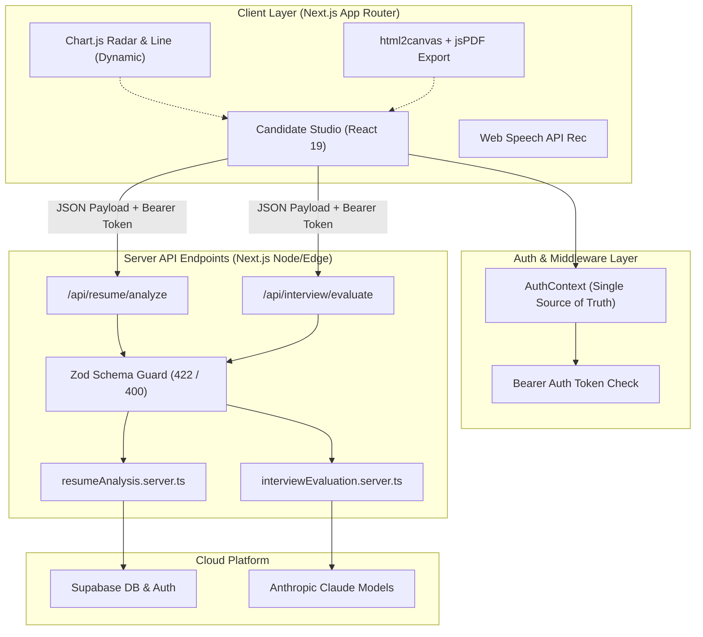

<div align="center">

  <h1>⚡ SKILLO</h1>
  <p><strong>Enterprise-Grade AI Mock Interview & Resume Intelligence Platform</strong></p>
  <p>Empowering software engineers with real-time AI interview simulations, deep resume alignment matrix parsing, and dynamic performance feedback analytics.</p>

  <br/>

  [](https://nextjs.org/)
  [](https://www.typescriptlang.org/)
  [](https://tailwindcss.com/)
  [](https://supabase.com/)
  [](https://zod.dev/)

</div>

<br/>

---

## 🌟 Overview

**Skillo** is a modern, full-stack AI career preparation platform built on **Next.js 16 App Router**. It bridges the gap between resume credentials and interview execution by pairing candidate resume data with target job specifications to deliver tailored, realistic mock assessments.

Candidates practice across **Technical Coding**, **System Architecture Design**, and **STAR Behavioral** tracks with adaptive AI recruiter personas, real-time speech-to-text recognition, and instant dimension scoring.

---

## 🔥 Key Capabilities & Highlights

| Feature | Description | Technical Implementation |
|---|---|---|
| 📄 **Resume Intelligence Engine** | Parses technical competencies, experience timelines, and projects against target JDs to compute a Match Index percentage. | Server-side Zod validation + custom string sanitization & match scoring logic. |
| 🎭 **Adaptive AI Personas** | Practice with distinct recruiter personas (e.g. *Sarah Chen* - Staff Lead, *David Vance* - Engineering Manager, *TechBot v2.4* - Strict Assessor). | Persona-based pacing, voice synthesis parameters, and scoring criteria. |
| 🎙️ **Dual Workspace Studio** | Toggle seamlessly between live Speech-to-Text voice recording and a code editor typing interface. | Web Speech API integration (`window.SpeechRecognition`) with SSR safety guards. |
| 📊 **Competency Radar Analytics** | Visual evaluation matrix measuring Technical Knowledge, Communication, Depth & Logic, and Time Management. | `react-chartjs-2` & Chart.js with dynamic code-splitting (`ssr: false`). |
| 📄 **PDF Report Generation** | Export complete assessment diagnostics and question logs as structured PDF files. | On-demand dynamic invocation of `html2canvas` and `jsPDF`. |
| 🔐 **Zero-Trust API Hardening** | Authenticated, validated backend API endpoints (`/api/resume/analyze`, `/api/interview/evaluate`). | Supabase Bearer token verification + Zod schema validation & generic `500` error masks. |

---

## 🏗️ System Architecture & Data Flow



---

## 🚀 Quick Start Guide

### 1. Prerequisites
- **Node.js**: `v18.17.0` or higher (v20+ recommended)
- **Package Manager**: `npm` (or `pnpm` / `yarn`)

### 2. Installation
```bash
# Clone repository
git clone https://github.com/sylbornfurtado19/Skillo.git

# Navigate into directory
cd Skillo

# Install dependencies
npm install
```

### 3. Environment Setup
Copy the example environment file to `.env.local`:
```bash
cp .env.example .env.local
```

Update `.env.local` with your configuration:
```env
# Public Supabase Settings
NEXT_PUBLIC_SUPABASE_URL=https://your-supabase-project.supabase.co
NEXT_PUBLIC_SUPABASE_ANON_KEY=your-supabase-anon-key

# Server-Side Keys (Private)
ANTHROPIC_API_KEY=sk-ant-your-api-key
```

### 4. Development Server
Start the Next.js Turbopack dev server:
```bash
npm run dev
```
Open **[http://localhost:3000](http://localhost:3000)** in your browser.

---

## 📡 API Endpoint Reference

### `POST /api/resume/analyze`
Parses candidate resume payload and computes job description alignment metrics.

- **Headers**: `Authorization: Bearer <supabase_access_token>`
- **Request Body**:
  ```json
  {
    "fileName": "Resume.pdf",
    "jobTitle": "Senior Frontend Architect",
    "jobDescription": "We are seeking a React 19 & TypeScript specialist..."
  }
  ```
- **Responses**: `200 OK` (Success), `401 Unauthorized`, `400 Bad Request`, `422 Unprocessable Entity`, `500 Internal Server Error`.

### `POST /api/interview/evaluate`
Evaluates submitted interview question responses and compiles comprehensive feedback diagnostics.

- **Headers**: `Authorization: Bearer <supabase_access_token>`
- **Request Body**:
  ```json
  {
    "setupData": {
      "domain": "Computer Science",
      "role": "Software Engineer",
      "experienceLevel": "Senior",
      "type": "Technical",
      "persona": "sarah"
    },
    "questionsList": [
      { "id": "q_1", "question": "Explain React's virtual DOM reconciliation algorithm." }
    ],
    "answersList": [
      { "questionId": "q_1", "answerText": "Reconciliation compares virtual DOM trees..." }
    ]
  }
  ```
- **Responses**: `200 OK` (Success), `401 Unauthorized`, `400 Bad Request`, `422 Unprocessable Entity`, `500 Internal Server Error`.

---

## 🛠️ Verification & Build Commands

```bash
# Type-check TypeScript codebase strictly
npx tsc --noEmit

# Run Next.js production build check
npm run build

# Run local production server
npm run start
```

---

## 📂 Project Structure

```text
Skillo/
├── app/                        # Next.js 16 App Router Routes
│   ├── (app)/                  # Main Application Route Group
│   │   ├── dashboard/          # Analytics & Metrics View
│   │   ├── setup/              # Interview Setup View
│   │   ├── interview/          # Live Interview Workspace
│   │   ├── results/            # Performance Diagnostics & PDF Export
│   │   ├── resume/             # Resume Upload & Job Matcher
│   │   ├── profile/            # Candidate Profile
│   │   └── settings/           # Assessor & UI Preferences
│   ├── api/                    # Hardened Server API Endpoints
│   │   ├── resume/analyze/     # Resume Analysis Route Handler
│   │   └── interview/evaluate/ # Interview Evaluation Route Handler
│   ├── layout.tsx              # Root HTML & Font Provider
│   └── providers.tsx           # Global Auth & State Providers
├── src/                        # Source Code & Components
│   ├── components/             # Reusable UI & Layout Components
│   ├── context/                # AuthContext & InterviewContext
│   ├── hooks/                  # Custom React Hooks (useAuth)
│   ├── lib/                    # Supabase Client & Server Services
│   │   └── services/           # Server-side Business Logic Delegates
│   ├── services/               # Client Service Modules & Constants
│   ├── types/                  # Strict TypeScript Interfaces
│   └── views/                  # Modular View Page Components
├── .env.example                # Environment Variable Template
├── next.config.js              # Next.js Configuration
├── tailwind.config.js          # Tailwind CSS Theme System
└── tsconfig.json               # Strict TypeScript Compiler Options
```

---

## 📜 License
This project is licensed under the **MIT License**.
