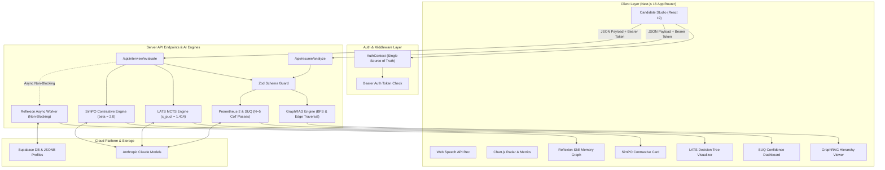

<div align="center">

  <h1>⚡ SKILLO AI</h1>
  <p><strong>Enterprise-Grade AI Mock Interview & Resume Intelligence Platform</strong></p>
  <p>Empowering software engineers with real-time AI interview simulations, deep resume alignment matrix parsing, and dynamic SOTA evaluation analytics.</p>

  <br/>

  [](https://nextjs.org/)
  [](https://www.typescriptlang.org/)
  [](https://jestjs.io/)
  [](https://tailwindcss.com/)
  [](https://supabase.com/)
  [](https://zod.dev/)

</div>

<br/>

---

## 🌟 Overview

**Skillo AI** is a modern, full-stack AI career preparation platform built on **Next.js 16 App Router**. It bridges the gap between candidate resume credentials and high-stakes interview execution by pairing resume data with target job specifications to deliver tailored, realistic mock assessments.

Candidates practice across **Technical Coding**, **System Architecture Design**, and **STAR Behavioral** tracks with adaptive AI recruiter personas, real-time speech-to-text recognition, and dynamic competency scoring.

Under the hood, Skillo AI integrates **5 SOTA AI Research Engine Architectures** (Prometheus-2, LATS MCTS, GraphRAG, Reflexion, and SimPO) to bring mathematical confidence scoring, Monte Carlo Tree Search interview adaptivity, persistent cross-session skill memory, and length-normalized FAANG contrastive benchmarks into every session.

---

## 🔥 Key Capabilities & Highlights

| Feature | Description | Technical Implementation |
|---|---|---|
| 📄 **GraphRAG Resume Intelligence** | Extracts entities and prerequisite dependency edges from candidate resumes against JDs to construct a 3-tier skill graph. | Hierarchical Leiden community detection (L0/L1/L2), BFS topology, and upward edge gap traversal. |
| 🌲 **LATS Adaptive Interviewer** | Dynamically branches interview follow-ups using Monte Carlo Tree Search (MCTS) based on candidate response depth. | UCT formula ($c_{\text{puct}}=1.414$), Process Reward Model (PRM $V \in [0,1]$), and 3 action trajectories (`DEEP_DIVE`, `PIVOT`, `EDGE_CASE`). |
| 🧠 **Prometheus-2 & SUQ Evaluator** | Runs multi-pass Chain-of-Thought evaluations across score-anchored rubrics and quantifies score uncertainty. | $N=5$ parallel CoT passes, score-variance clustering ($\le 0.5$), and Semantic Entropy $\text{SE} = -\sum P(c) \log_2 P(c)$. |
| 🔄 **Reflexion Skill Memory** | Maintains persistent verbal self-reflections and tracks skill proficiency evolution over time across sessions. | Non-blocking async worker, Supabase `profiles` JSONB storage, and cross-session LLM prompt injection. |
| ⚡ **SimPO Contrastive Benchmark** | Compares candidate responses side-by-side against FAANG-grade preferred benchmark answers. | Implicit length-normalized reward $r = \frac{\beta \cdot \text{quality}}{\max(1, \|y\|)}$, dynamic margin $\Delta r$, and Zod delta parsing. |
| 🎭 **Adaptive AI Personas** | Practice with distinct recruiter personas (e.g. *Sarah Chen* - Staff Lead, *David Vance* - Engineering Manager, *TechBot v2.4* - Strict Assessor). | Persona-based pacing, voice synthesis parameters, and scoring criteria. |
| 🎙️ **Dual Workspace Studio** | Toggle seamlessly between live Speech-to-Text voice recording and a code editor typing interface. | Web Speech API integration (`window.SpeechRecognition`) with SSR safety guards. |
| 📊 **Competency Radar Analytics** | Visual evaluation matrix measuring Technical Knowledge, Communication, Depth & Logic, and Time Management. | `react-chartjs-2` & Chart.js with dynamic code-splitting (`ssr: false`). |
| 📄 **PDF Report Generation** | Export complete assessment diagnostics and question logs as structured PDF files. | On-demand dynamic invocation of `html2canvas` and `jsPDF`. |
| 🔐 **Zero-Trust API Hardening** | Authenticated, validated backend API endpoints (`/api/resume/analyze`, `/api/interview/evaluate`). | Supabase Bearer token verification + Zod schema validation & generic `500` error masks. |

---

## 🧬 5 State-of-the-Art AI Research Engines

### 1. 🧠 Prometheus-2 Fine-Grained Rubric & SUQ Engine
* **Research Foundation**: *Prometheus 2* (Kim et al., 2024) + *Semantic Uncertainty Quantification* (Kuhn et al., ICLR 2023).
* **Implementation**: Executes $N=5$ stochastic Chain-of-Thought (CoT) evaluation passes per submission across 4 score-anchored rubric criteria. Computes **Semantic Entropy**:
  $$\text{SE}(x) = -\sum_{c \in \mathcal{C}} P(c) \log_2 P(c)$$
* **Output**: Renders real-time confidence levels (**HIGH**, **MEDIUM**, **LOW**) on the candidate results dashboard.

### 2. 🌲 Language Agent Tree Search (LATS) MCTS Adaptive Interviewer
* **Research Foundation**: *LATS* (Zhou et al., ICML 2024).
* **Implementation**: Uses Monte Carlo Tree Search (MCTS) to select optimal question trajectories by maximizing Upper Confidence Bound for Trees:
  $$\text{UCT}(s,a) = Q(s,a) + c_{\text{puct}} \cdot P(s,a) \cdot \frac{\sqrt{N(s)}}{1 + N(s,a)} \quad (c_{\text{puct}} = 1.414)$$
* **Output**: Expands 3 distinct branch actions (`DEEP_DIVE`, `PIVOT`, `EDGE_CASE_CHALLENGE`) evaluated via Process Reward Model ($V \in [0,1]$).

### 3. 🕸️ GraphRAG Hierarchical Skill Gap Mapper
* **Research Foundation**: *GraphRAG Approach to Query-Focused Summarization* (Edge et al., Microsoft Research 2024).
* **Implementation**: Constructs an entity-relationship graph from resumes and JDs. Uses BFS connected-component topological sorting to partition entities into 3 levels: **L0 Macro Domain**, **L1 Core Pillars**, and **L2 Leaf Utilities**.
* **Output**: Traverses `prerequisites[]` graph edges to map exact root cause skill gaps.

### 4. 🔄 Reflexion Agent & Dynamic Skill Memory
* **Research Foundation**: *Reflexion: Verbal Reinforcement Learning* (Shinn et al., NeurIPS 2023).
* **Implementation**: Generates non-blocking post-evaluation verbal self-critiques ($SR_t$) detailing mistake summaries, root cause analysis, and actionable remediation. Consolidates into `CandidateSkillMemoryStore` persisted in Supabase JSONB.
* **Output**: Automatically injects prior session context into subsequent interview prompts and tracks proficiency progression (**NOVICE** $\rightarrow$ **DEVELOPING** $\rightarrow$ **PROFICIENT** $\rightarrow$ **MASTERED**).

### 5. ⚡ SimPO Length-Normalized Contrastive Evaluator
* **Research Foundation**: *SimPO* (Meng et al., ICML 2024).
* **Implementation**: Evaluates candidate answers side-by-side with FAANG-grade benchmark responses using implicit length-normalized reward:
  $$r(x,y) = \frac{\beta \cdot \text{qualityScore}}{\max(1, |y|)} \quad (\beta = 2.0)$$
* **Output**: Calculates target reward margin $\Delta r = r_{\text{preferred}} - r_{\text{dispreferred}}$ and structural deltas (`COMPLEXITY`, `SYSTEM_ARCHITECTURE`, `EDGE_CASES`, `TERMINOLOGY`) protected by strict Zod schema validation.

---

## 🏗️ System Architecture & Data Flow



---

## 🚀 Quick Start Guide

### 1. Prerequisites
- **Node.js**: `v18.17.0` or higher (v20+ recommended)
- **Package Manager**: `npm` (or `pnpm` / `yarn`)

### 2. Installation
```bash
# Clone repository
git clone https://github.com/sylbornfurtado19/Skillo.git

# Navigate into directory
cd Skillo

# Install dependencies
npm install
```

### 3. Environment Setup
Copy the example environment file to `.env.local`:
```bash
cp .env.example .env.local
```

Update `.env.local` with your configuration:
```env
# Public Supabase Settings
NEXT_PUBLIC_SUPABASE_URL=https://your-supabase-project.supabase.co
NEXT_PUBLIC_SUPABASE_ANON_KEY=your-supabase-anon-key

# Server-Side Keys (Private)
ANTHROPIC_API_KEY=sk-ant-your-api-key
```

### 4. Database Setup (Supabase)
Run the following SQL migration in your Supabase SQL Editor:
```sql
ALTER TABLE public.profiles
  ADD COLUMN IF NOT EXISTS skill_memory_store JSONB DEFAULT '{}';
```

### 5. Development Server
Start the Next.js Turbopack dev server:
```bash
npm run dev
```
Open **[http://localhost:3000](http://localhost:3000)** in your browser.

---

## 📡 API Endpoint Reference

### `POST /api/resume/analyze`
Parses candidate resume payload and executes GraphRAG entity-relationship extraction and prerequisite gap mapping.

- **Headers**: `Authorization: Bearer <supabase_access_token>`
- **Request Body**:
  ```json
  {
    "fileName": "Resume.pdf",
    "jobTitle": "Senior Frontend Architect",
    "jobDescription": "We are seeking a React 19 & TypeScript specialist..."
  }
  ```
- **Responses**: `200 OK` (Success), `401 Unauthorized`, `400 Bad Request`, `422 Unprocessable Entity`, `500 Internal Server Error`.

### `POST /api/interview/evaluate`
Evaluates submitted interview responses through Prometheus-2 multi-pass SUQ, generates LATS follow-up trajectories, computes SimPO contrastive benchmarks, and triggers async Reflexion memory updates.

- **Headers**: `Authorization: Bearer <supabase_access_token>`
- **Request Body**:
  ```json
  {
    "setupData": {
      "domain": "Computer Science",
      "role": "Software Engineer",
      "experienceLevel": "Senior",
      "type": "Technical",
      "persona": "sarah"
    },
    "questionsList": [
      { "id": "q_1", "question": "Explain React's virtual DOM reconciliation algorithm." }
    ],
    "answersList": [
      { "questionId": "q_1", "answerText": "Reconciliation compares virtual DOM trees..." }
    ]
  }
  ```
- **Responses**: `200 OK` (Success), `401 Unauthorized`, `400 Bad Request`, `422 Unprocessable Entity`, `500 Internal Server Error`.

---

## 🛠️ Verification & Build Commands

```bash
# Type-check TypeScript codebase strictly (0 errors)
npx tsc --noEmit

# Run Jest AI Engine unit test suite (25/25 PASSING)
npm test

# Run Next.js production build check
npm run build

# Run local production server
npm run start
```

---

## 📂 Project Structure

```text
Skillo/
├── app/                        # Next.js 16 App Router Routes
│   ├── (app)/                  # Main Application Route Group
│   │   ├── dashboard/          # Analytics & Metrics View
│   │   ├── setup/              # Interview Setup View
│   │   ├── interview/          # Live Interview Workspace
│   │   ├── results/            # Performance Diagnostics & Prometheus-2 View
│   │   ├── resume/             # GraphRAG Resume Upload & Job Matcher
│   │   ├── profile/            # Reflexion Candidate Profile & Skill Memory
│   │   └── settings/           # Assessor & UI Preferences
│   ├── api/                    # Hardened Server API Endpoints
│   │   ├── resume/analyze/     # GraphRAG Resume Analysis Route
│   │   └── interview/evaluate/ # Prometheus-2 / LATS / SimPO Evaluation Route
│   ├── layout.tsx              # Root HTML & Font Provider
│   └── providers.tsx           # Global Auth & State Providers
├── src/                        # Source Code & Components
│   ├── components/             # Reusable UI Components
│   │   └── ui/                 # Research Dashboards & Visualizer Cards
│   ├── context/                # AuthContext & InterviewContext
│   ├── hooks/                  # Custom React Hooks (useAuth)
│   ├── lib/                    # Supabase Client & Server Services
│   │   └── services/           # 5 AI Research Engine Services
│   │       ├── interviewEvaluation.server.ts # Master Orchestrator
│   │       ├── latsEngine.server.ts          # LATS MCTS Engine
│   │       ├── graphRAG.server.ts            # GraphRAG Engine
│   │       ├── reflexionEngine.server.ts     # Reflexion Memory Engine
│   │       ├── simpoEngine.server.ts         # SimPO Contrastive Engine
│   │       └── resumeAnalysis.server.ts      # Resume Analysis Delegate
│   ├── services/               # Client Service Modules & Constants
│   ├── types/                  # Strict TypeScript Interfaces (`index.ts`)
│   └── views/                  # Modular View Page Components
├── tests/                      # Jest AI Engine Unit Test Suite
│   └── aiEngine.test.ts        # 25 Tests (SUQ, UCT, SimPO, GraphRAG, Reflexion)
├── audit.md                    # Master Post-Remediation Verification Report
├── jest.config.cjs             # ESM-compatible Jest Config
├── .env.example                # Environment Variable Template
├── next.config.js              # Next.js Configuration
├── tailwind.config.js          # Tailwind CSS Theme System
└── tsconfig.json               # Strict TypeScript Compiler Options
```

---

## 📜 License
This project is licensed under the **MIT License**.
